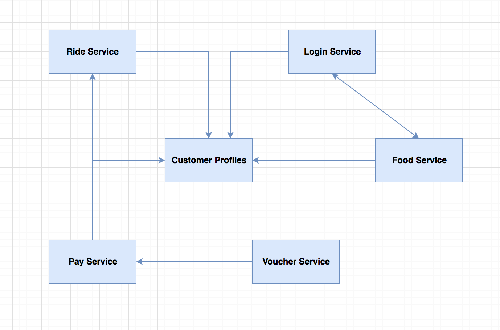
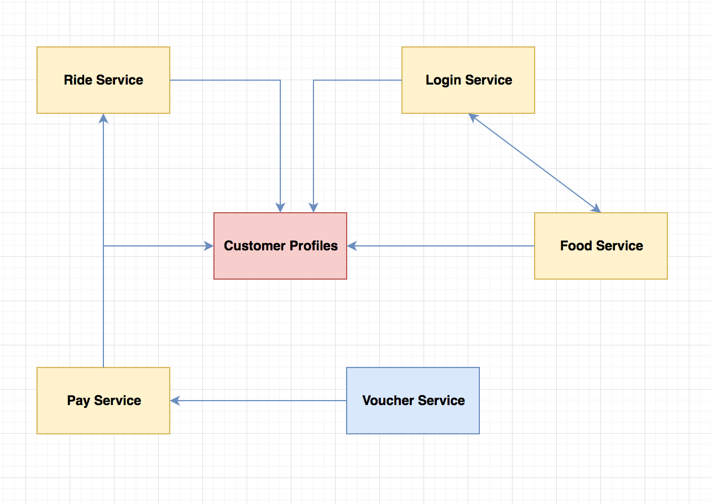
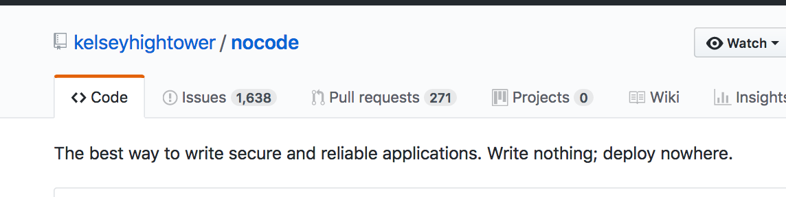
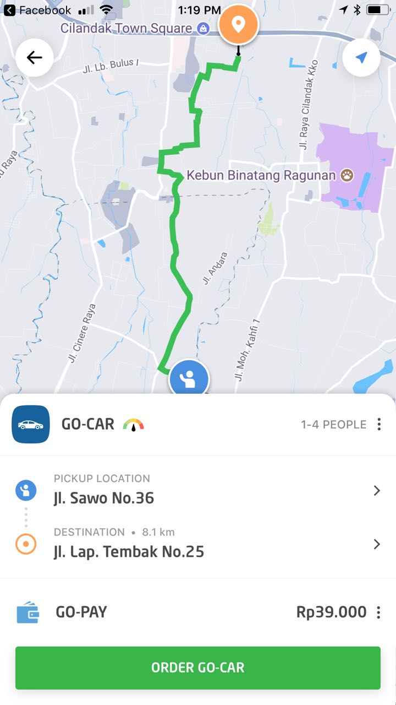
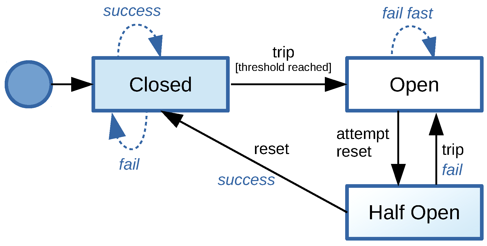
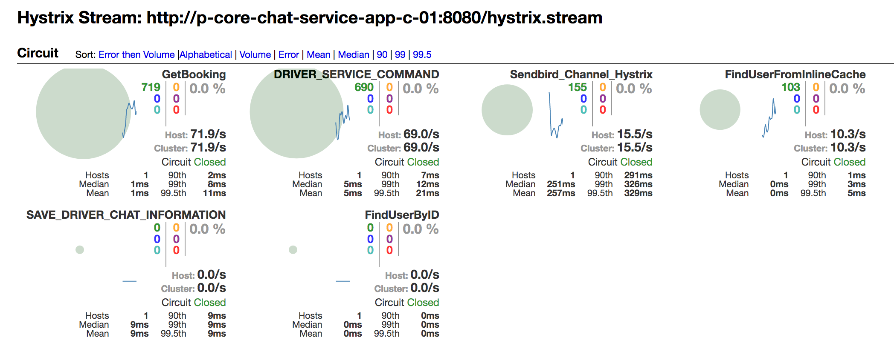

# Resiliency in Distributed Systems

Before jumping into discussing resiliency in distributed systems, Lets
quickly refresh some basic terminologies:

### Basic Terminologies

#### Resiliency

It is the capacity of any system to recover from
difficulties.

#### Distributed Systems 

These are networked components which communicate with each other by
passing messages most often to achieve a common goal.

#### Availability

Probability that any system is operating at time `t`.

### Faults vs Failures

Fault is an incorrect internal state in your system.
Some common examples of fault in our systems include:

1. Slowing down of storage layer
2. Memory leaks in application
3. Blocked threads
4. Dependency failures
5. Bad data propogating in the system (Most often because of not enough
   validations for input data)

Systems all healthy in absence of faults:

<p align="center"></p>

Systems affected in the presence of faults:

<p align="center"></p>

Whereas, Failure is inability of the system to perform its intended job. Failure
means loss of uptime and availability on systems.

Faults if not contained from propogating can lead to failures.

Systems failing when fault turned into failure:

<p align="center"></p>

`Resiliency is all about preventing faults turning into failures`

### Why do we care about resiliency in our systems ?

Resiliency of a system is directly proportional to its uptime and
availability. The more resilient the systems are the more available it
is to serve users.

Failing to be resilient can affect companies in many ways. For GO-JEK,
going down can have this impact:

1. It can lead to financial losses for the company
2. Losing customers to competitors
3. Affecting livelihood of drivers 
4. Affecting livelihood of customers

### Resiliency in distributed systems is hard

We all by now understand that being available is critical. And to be
available, we need to build in resiliency from ground up in our systems so
that faults in our systems auto-heal.

But building in resiliency in a complex microservices architecture with
multiple distributed systems communicating with each other is difficult.
Some of the things which make this hard are:

1. The network is unreliable
2. Dependencies can always fail
3. User behavior is unpredictable 

Though building resiliency is hard, it is not impossible. Following some
of the patterns while building distributed systems can help us acheive
high uptime across our services. We will discuss some of these patterns
going ahead:

### Pattern[0] = nocode

`The best way to write reliable and secure applications is write no code
 at all - Write Nothing and Deploy nowhere` - Kelsey Hightower

<p align="center"></p>

 The most resilient piece of code you ever write will be the code you
 never wrote. The lesser the code you write, lower are the reasons for
 it to break. 

### Pattern[1] = Timeouts

_Stop waiting for an answer_

The default Go http client has no HTTP timeout. This causes 
application to leak goroutines (to handle every request Golang spawns
a go-routine). When you have a slow/failed downstream service, the go
routine waits forever for the reply from downstream service. To avoid this
problem, it is important that we add timeouts for every integration
point in our application.

For example: you can set timeout using
[Heimdall](https://github.com/gojektech/heimdall/) like:

```go 
    httpClient := heimdall.NewHTTPClient(1 * time.Millisecond) 
    _, err := httpClient.Get("https://gojek.com/drivers", http.Header{})
```

This will help you fail fast if the downstream service does not reply back
within 1ms.

Timeouts in application can help in following ways:

#### Preventing cascading failures 

Cascading failures are failures which propogate very quickly to other
parts of the system. These are very bad if unmanaged. 

Timeouts help us prevent these failures by failing fast. When downstream
services fail or are slower (violating their SLA), instead of waiting for
the answer forever, you fail early to save your system as well as the
systems which are dependent on yours.

#### Providing failure isolation

Failure isolation is the concept of isolating failures to only some part
of a system or a sub system.

Timeouts allow you to have failure isolation by not making some other
systems problem your problem.

#### How should timeouts be set ?  

Timeouts must be based on the SLAs provided by your dependencies. For
example, this could be around the dependency's 99.9th percentile. 

### Pattern[2] = Retries

_If you fail once, try again_

Retries can help reduce recovery time. They are very effective when
dealing with intermittent failures.

For ex: You can do retries with constant backoff using 
[Heimdall](https://github.com/gojektech/heimdall/) like:

```go
    backoff := heimdall.NewConstantBackoff(500)
    retrier := heimdall.NewRetrier(backoff)
    httpClient := heimdall.NewHTTPClient(1 * time.Millisecond)
    
    httpClient.SetRetrier(retrier)
    httpClient.SetRetryCount(3)
    
    httpClient.Get("https://gojek.com/drivers", http.Header{})
```

Retries works well in conjunction with timeouts, when you timeout you
retry the request.

#### Retrying immediately might not always be useful

Dependency failures take time to recover in which case retrying could lead
to longer wait times for your users. To avoid these long wait times, we
could potentially queue and retry these requests wherever possible. For
example, GO-JEK sends out OTP in sms when you try to login. Instead of
trying to send SMS synchronously with our telecom providers, we queue
these requests and retry them. This helps us decouple our systems from
failures of our telecom providers.

#### Idempotency is important 

From Wikipedia:

Idempotence is the property of certain operations that they can be
applied multiple times without changing the result beyond the initial
application.

Consider a scenario in which the request to some server was processed but
failed to reply back with result. In this case, the client tries to retry
the same operation. If the operation is not idempotent this will lead to
inconsistent states across your systems.

For example: In GO-JEK, non-idempotent operations in the booking creation
flow can lead to multiple bookings being created for the same user as well
as same driver being allocated to multiple bookings.

### Pattern[3] = Fallbacks

_Degrade gracefully_

When there are faults in your systems, they can choose to use alternative
mechanisms to respond with a degraded response instead of failing
completely.

#### Curious case of Maps Service

At GO-JEK, we use Google Maps service for variety of reasons. We use it to
calculate the route path of our customers from their pickup location to
destination, estimating fares etc. We have a Maps service which is an
interface for all of our calls to Google. Initially, we used to have
booking creation failures because of slowdown on Google maps apis. Our
system was not fault tolerant against these slight increase in latencies.
This is how the route path looks like when systems are operating as
expected.

<p align="center"></p>

The solution we went with was to fallback to a route approximation for
routing. When this fallback kicks in, systems dependending on maps
services work in a degraded mode and the route on the map looks like this:

<p align="center"></p>

Fallbacks in the above scenario helped us prevent catastrophic failure
wherein the whole of booking creation used to fail.

It is important to think of fallbacks at all of your integration points.

### Pattern [4] = Circuit Breakers

_Trip the circuit to protect your dependencies_

Circuit breakers are used in households to prevent sudden surge in current
preventing your house from burning down. These trip the circuit and stop
flow of current. 

This same concept could be applied to our systems wherein you stop making
calls to downstream services when you know that the system is unhealthy
and failing. 

The state transitions on a typical circuit breaker(CB) looks like this:

<p align="center"></p>

Initially when systems are healthy, the CB is in `closed` state. In this
state, it makes calls to downstream services. When certain number of
requests fail, the CB trips the circuit and goes into `open` state. In
this state, CB stops making any requests to failing downstream service.
After a certain `sleep threshold`, CB attempts reset by  going into `half
open` state. If the next request in this state is successful, it goes to
`open` state. If this call fails, it stays in `open` state.

`Hystrix` by Netflix is a popular implementation of this pattern.

You can setup a simple hystrix Circuit breaker using 
[Heimdall](https://github.com/gojektech/heimdall/) like:

```go
    config := heimdall.HystrixCommandConfig{
                            MaxConcurrentRequests:  100,
                            ErrorPercentThreshold:  25,
                            SleepWindow:            10,
                            RequestVolumeThreshold: 10,
    }
    
    hystrixConfig := heimdall.NewHystrixConfig("MyCommand", config)
    
    timeout := 10 * time.Millisecond
    httpClient := heimdall.NewHystrixHTTPClient(timeout, hystrixConfig)
    
    _, err := httpClient.Get("https://gojek.com/drivers", http.Header{})
```

The above code sets up a hystrix circuit breaker with timeout of 10ms allowing 100 max concurrent requests, with error percent of 25% and sleep window of 10ms.

Circuit breakers are required at integration points, help preventing cascading
failures allowing the failing service to recover.

You also need good metrics/monitoring around this to detect various state
transitions across various integration points. Hystrix has dashboards
which helps you visualise state transitions.

<p align="center"></p>

### Pattern[5] = Resiliency Testing

_Test to Break_

It is important to simulate various failure conditions within your system.
For example: Simulating various kinds of network failures, latencies in
network, dependencies being slow or dead etc. After determining various
failure modes, you codify it by creating some kind of test harness around
it. These tests help you exercise some failure modes on every change to
code.

#### Injecting failures
Injecting failures into your system is a technique to induce faults
purposefully to test resiliency. These kind of failures help us exercise
a lot of unknown unknowns in our architecture.

Netflix has championed this approach with tools like Chaos Monkey, Latency
monkey etc which are part of [Simian
Army](https://github.com/Netflix/SimianArmy) suite of applications.

### In Conclusion: 

Though following some of these patterns will help you acheive resiliency,
these are no silver bullet. Systems do fail, and the sad truth is we have
to deal with these failures. These patterns if excercised can help us
achieve significant uptime on services. 

We have to `Design our systems for failure`.

#### References:

- We have open sourced [Heimdall - Enhanced HTTP client in
  GO](https://github.com/gojektech/heimdall/) which helps us implement
  some of these patterns in a single place.

 - Would recommend reading [Release
   It](https://pragprog.com/book/mnee/release-it) by Michael Nygard.

 - This blog post is inspired from the talk I gave on the same topic at
   Gophercon India 2018, the slides for which can be found
   [here](https://slides.com/rajeevbharshetty/resiliency-in-distributed-systems)
